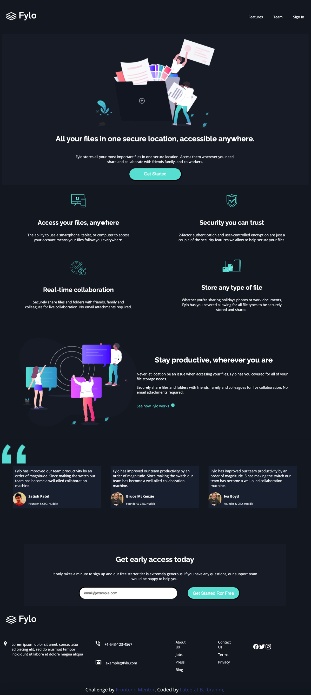

# Frontend Mentor - Fylo dark theme landing page solution

This is a solution to the [Fylo dark theme landing page challenge on Frontend Mentor](https://www.frontendmentor.io/challenges/fylo-dark-theme-landing-page-5ca5f2d21e82137ec91a50fd). Frontend Mentor challenges help you improve your coding skills by building realistic projects. 

## Table of contents

- [Overview](#overview)
  - [The challenge](#the-challenge)
  - [Screenshot](#screenshot)
  - [Links](#links)
- [My process](#my-process)
  - [Built with](#built-with)
  - [What I learned](#what-i-learned)
  - [Continued development](#continued-development)
  - [Useful resources](#useful-resources)
- [Author](#author)
- [Acknowledgments](#acknowledgments)

**Note: Delete this note and update the table of contents based on what sections you keep.**

## Overview

### The challenge

Users should be able to:

- View the optimal layout for the site depending on their device's screen size
- See hover states for all interactive elements on the page

### Screenshot

### Links

- Solution URL: [Add solution URL here](https://your-solution-url.com)
- Live Site URL: [Add live site URL here](https://your-live-site-url.com)

## My process
- I created a css file and added added html tags to the index file given in the challenge. 
- I decided to add the styling as I went along.

### Built with

- Semantic HTML5 markup
- CSS custom properties
- Flexbox

### What I learned

- I learnt how to use Flexbox to style a responsive page.

### Continued development

- The challenge was given by the Sidehustle Intern 3.0 program, and the time was limited, I couldn't explore the use of the Grid sysytem in CSS.
- I hope to learn how to use Grid and continue learning Flexbox.

### Useful resources

- [Traversy Media](https://youtu.be/JJSoEo8JSnc) - This Traversy video really helped me to understand Flexbox.
- [Cem Eygi Media](https://youtu.be/mh36Kts-wX8) - This is video helped me understand how to build a Navbar with logo.
- [ionic](https://ionic.io/ionicons) - I got free social media icons from this site.

## Author

- Website - [Lateefat B. Ibrahim](https://www.rubyethicalservices.com)
- Frontend Mentor - [@Lateefat](https://www.frontendmentor.io/profile/Lateefat)

## Acknowledgments

A big shout out to the Sidehustle Internship 3.0 program .hey have created a huge learning opportunity to those willing to learn.

This is not forgetting the Frontend Development co-interns. Many gave help and links to resources  freely.

Bless you all guys.

